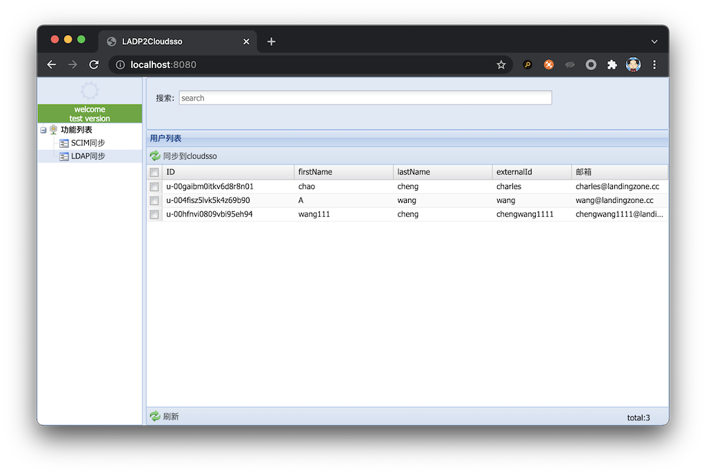

# 配置文件

```shell
key_aliyun_cloudsso = 8aAJCtpbyPJ**********************************************
ldap_url = ldap://127.0.0.1:389
ldap_username = username
ldap_password = password
ldap_searchbase = ou=hangzhou,dc=landingzone,dc=cc

ldap_attr_firstname = givenName
ldap_attr_lastname = sn
ldap_attr_email = userPrincipalName
ldap_attr_externalid = sAMAccountName
ldap_attr_displayname = userPrincipalName
ldap_attr_username = userPrincipalName
```

#### 读取顺序

- dreamweb.jar同目录下的dreamweb.properties
- home目录下的dreamweb.properties

# 启动类(springboot)
`cc.landingzone.dreamweb.DreamwebApplication`


# 打包

`mvn clean package -Dmaven.test.skip=true`


# 截屏

