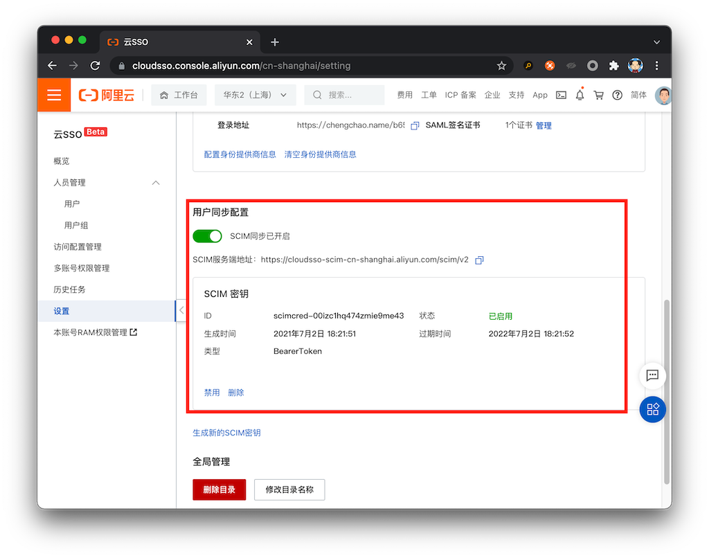
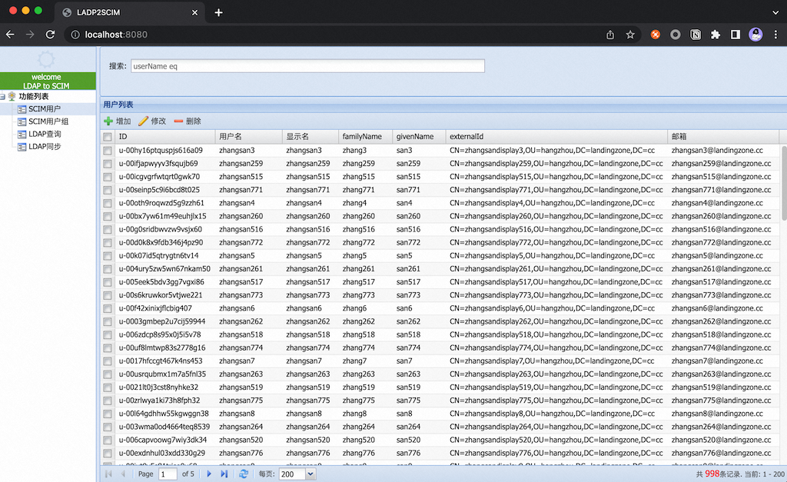
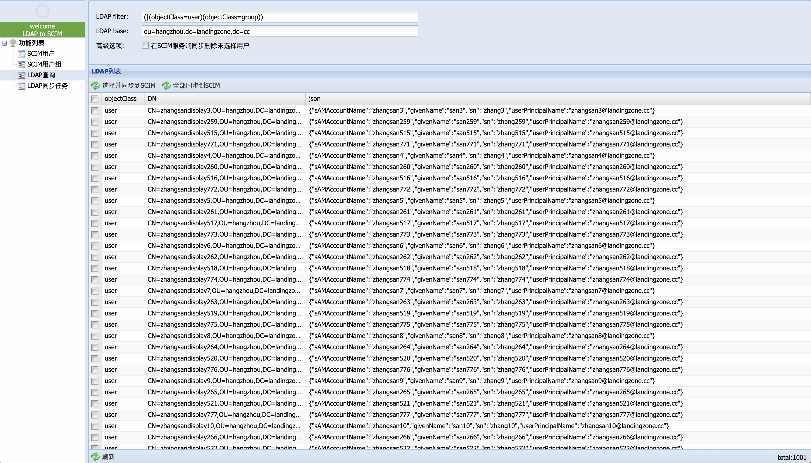
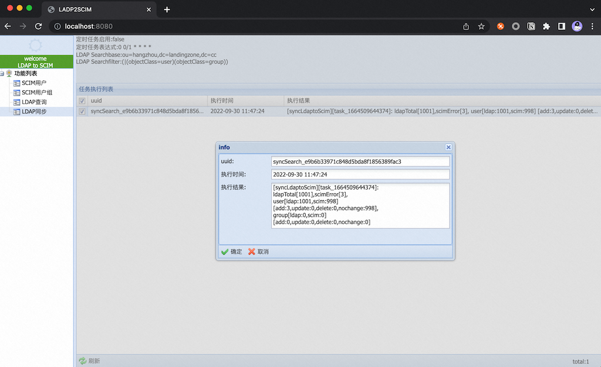

# 配置文件

```properties
# scim 连接信息
scim_key = scim key
scim_url = scim server url

# ldap 连接信息
ldap_url = ldap://127.0.0.1:389
ldap_username = username
ldap_password = password

# ldap 搜索条件
ldap_searchbase = ou=hangzhou,dc=landingzone,dc=cc
ldap_searchfilter = (objectClass=user)

# ldap和scim字段的对应关系
scim_attr_givenname = givenName
scim_attr_familyname = sn
scim_attr_email = userPrincipalName
scim_attr_externalid = distinguishedName
scim_attr_displayname = sAMAccountName
scim_attr_username = sAMAccountName

# 是否开启定时同步
scim_sync_cron_enabled = false
scim_sync_cron_expression = 0 0 6 * * ? 
```

cron表达式示例: https://help.aliyun.com/document_detail/64769.html

#### 配置文件读取顺序

1. 运行时参数,示例: java -jar -DconfigPath=/home/test/ldap2scim.properties ldap2scim.jar  
2. ldap2scim.jar同目录下的ldap2scim.properties
3. 用户home/config/目录下的ldap2scim.properties

#### scim_key&scim_url




# 部署
基于springboot搭建

打包: `mvn clean package -Dmaven.test.skip=true`

代码启动: main class: `ldap2scim.Ldap2scimApplication`

jar包启动: `java -jar ldap2scim.jar`


# 界面截图

#### SCIM查询界面



#### LDAP 查询界面

LDAP的搜索语法可以[参考这里](https://www.cnblogs.com/dreamer-fish/p/5832735.html)



#### 任务查看界面

手动同步&自动同步的任务都会展示在这里,双击可以看详情

